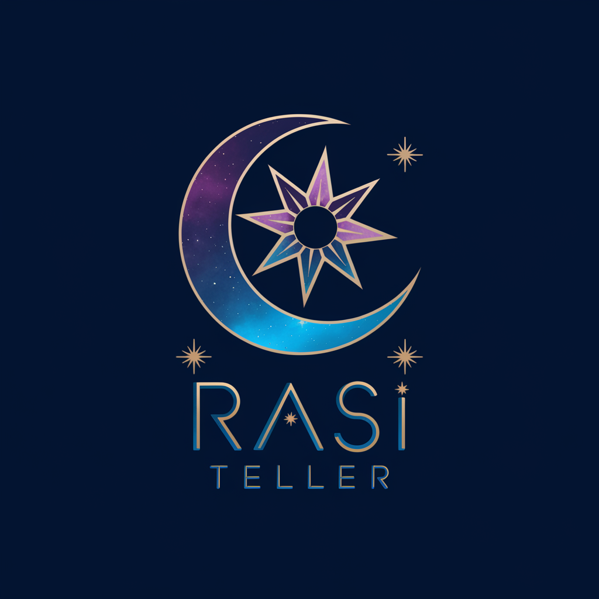

# Rasi Teller 🌙✨

**Rasi Teller** is an interactive astrology-inspired web application designed to deliver fortunes and celestial insights. Powered by a modern design and user-friendly interface, this app showcases a starry theme and smooth user interactions.

  

  
  
  

---

## Features

- **Dynamic Fortune Display:** Fortune messages are fetched from a JSON file and displayed randomly.
- **Modern Styling:** Clean and elegant design powered by CSS.
- **Responsive Design:** Optimized for various screen sizes for a seamless experience.
- **Beautiful Theme:** A celestial-inspired aesthetic with a rich dark blue background.

---

## License

This project is open source and available under the [GPL=3.0 License](LICENSE).
